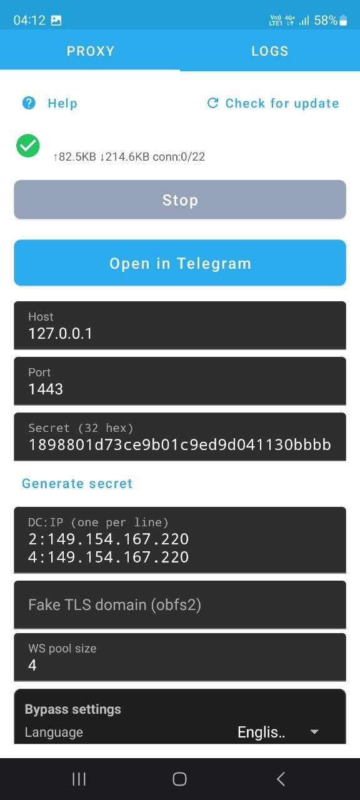
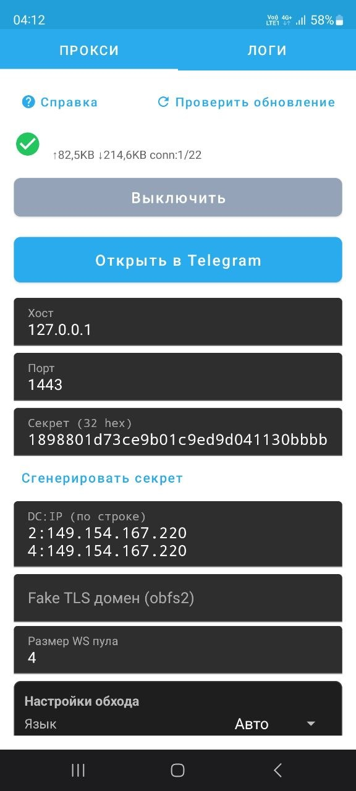

# tg-ws-proxy-android

[](https://developer.android.com/)
[](https://kotlinlang.org/)
[](LICENSE)

> Android Kotlin port of [**tg-ws-proxy**](https://github.com/Flowseal/tg-ws-proxy) by [Flowseal](https://github.com/Flowseal).
>
> A **Telegram MTProto WebSocket Bridge Proxy** with advanced DPI bypass for Android devices.

---

## What is this?

**tg-ws-proxy-android** is an Android application that creates a local MTProto proxy server on your phone. It connects to Telegram's WebSocket (WS) endpoints using DPI-bypass techniques: DoH resolution, Cloudflare fallback, parallel connections, and fake TLS handshakes.

### Why not just use the original Python proxy?

The original [**tg-ws-proxy**](https://github.com/Flowseal/tg-ws-proxy) runs as a Python CLI on desktop. This project:
- **Ported to Android** using Kotlin + Android SDK 34
- **Runs as a foreground service** with persistent notification
- **GUI settings** instead of editing text files
- **In-app log viewer** with export/sharing
- **Optimised for mobile network** — less battery usage than Python + Termux
- **Fixed critical stability issues** discovered during real-world testing

---

## Features

| Feature | Description |
|---|---|
| **MTProto ↔ WebSocket Bridge** | Transparent bridge between Telegram app and Telegram DCs |
| **DoH (DNS-over-HTTPS)** | Bypass DNS spoofing with encrypted DNS resolution |
| **CF Proxy Fallback** | Automatic fallback via Cloudflare Workers if direct IPs are blocked |
| **Parallel Connect** | Race multiple IPs simultaneously for sub-second handshakes |
| **Auto Fake TLS** | Automatic TLS SNI camouflage for DPI bypass |
| **Media via CF** | Route media traffic through Cloudflare to save bandwidth |
| **Frame Padding + DoH Rotation** | Optional WS padding + cyclic DoH provider rotation |
| **Pre-warmed CF Pool** | Background health-check before first real connection (< 1s cold-start) |
| **Connection Pool** | Keep-alive pool with automatic refilling and age-based eviction |
| **Foreground Service** | Persistent notification, optional background restart |
| **In-app Logs** | Live log viewer with export to `.txt` (share or save to Downloads) |
| **Proxy Link** | Auto-generate `tg://proxy` link with dd/ee secret |
| **RU / EN Localization** | Auto-detect system language; manual switcher in Bypass Settings |
| **In-app Help** | Localized help screen with full feature docs |
| **Check for Updates** | Automatic GitHub Releases check on startup; manual button in toolbar |

---

## Screenshots

| English | Русский |
|---|---|
|  |  |

---

## Download

| Variant | File |
|---|---|
| **Release** (recommended) | `tg-ws-proxy-android.apk` |
| Debug | `tg-ws-proxy-android-debug.apk` |

Download from [Releases](../../releases).

### SHA-256 Checksum

```
94BC618BFB18A57852728513C616CC9A9AEE9A00F11637079E72023D9B8717F7
```

Verify after download:
```powershell
# Windows PowerShell
Get-FileHash -Path "tg-ws-proxy-android.apk" -Algorithm SHA256

# Linux / macOS
sha256sum tg-ws-proxy-android.apk
```

```bash
# Debug APK
$env:JAVA_HOME = 'C:\Program Files\Android\Android Studio\jbr'; .\gradlew.bat --no-daemon assembleDebug

# Release APK (requires release.keystore or use debug signing)
$env:JAVA_HOME = 'C:\Program Files\Android\Android Studio\jbr'; .\gradlew.bat --no-daemon assembleRelease
```

Outputs:
- Debug: `app/build/outputs/apk/debug/app-debug.apk`
- Release: `app/build/outputs/apk/release/tg-ws-proxy-android.apk`

---

## Bypass Modes

| Mode | When it triggers |
|---|---|
| **Direct WS** | Connects to `kws{dc}.web.telegram.org` via DoH + parallel TCP |
| **CF Fallback** | Triggered if direct WebSocket fails or DPI blocks it |
| **TCP Fallback** | Plain TCP to known DC IPs as last resort |
| **Cold-start fast lane** | Skips direct connect on first run (no CF history yet) for speed |

### Settings — Bypass Settings Card

| Setting | Default | Description |
|---|---|---|
| DoH resolving | ✅ on | Encrypted DNS resolution |
| Auto Fake TLS | ✅ on | SNI camo when direct IP blocked |
| Parallel connect | ✅ on | Multi-IP race for fast fallback |
| CF Proxy fallback | ✅ on | Use CF Worker backup |
| CF Proxy priority | ✅ on | Try CF before direct |
| Media via CF | ✅ off | Route downloads through CF |
| WS frame padding | ⬜ off | Random WS frame padding (DPI obfuscation) |
| Rotate DoH providers | ✅ on | Cycle Cloudflare → Google → Quad9 |
| Work in background | ⬜ off | Keep proxy alive after UI close |
| Language | Auto | Auto / Russian / English |
| Auto check for updates | ✅ on | Check GitHub Releases on startup |

---

## Roadmap

| Feature | Status | Notes |
|---|---|---|
| **QUIC transport instead of WS** | 🔮 **Research** | QUIC (UDP-based, HTTP/3) is harder for DPI to fingerprint and has faster 0-RTT handshake. Telegram does not yet expose QUIC for MTProto WebSocket; experimental if backend support appears. |
| **WireGuard / OpenVPN tunnel integration** | 🔮 **Research** | Would turn the app into a system-level VPN tunnel (`VpnService`) so all traffic (not just Telegram) is bypassed. This is a major architecture shift — evaluate if out of scope. |
| **Auto-update domain pool from upstream repo** | 📋 **Planned** | Periodically fetch fresh CF Worker domains from the upstream `tg-ws-proxy` pool. |

**Not on the roadmap:** F-Droid publication, iOS port.

---

## Known Issues & Fixes

| Issue | Cause | Fix (commit) |
|---|---|---|
| App crash on proxy connect | NPE in `ConcurrentHashMap.put(null)` from failed parallel socket | `51b51de` |
| Service killed / restart loop | `ForegroundServiceDidNotStartInTimeException` on sticky restart | `f9d5910` |
| Hanging after hours | Global `SSLSocketFactory` poisoning JVM | `5674d6f` |
| DNS NXDOMAIN flood | System DNS caches negative entries indefinitely | `5674d6f` |
| Socket FD exhaustion | Parallel connect leaked loser's sockets | `5674d6f` |
| Telegram handshake timeout | `soTimeout=10s` too short for MTProto handshake silence | `5674d6f` |

Full changelog: [CHANGELOG.md](CHANGELOG.md)

---

## Architecture (Port Mapping)

| Original Python | Kotlin port |
|---|---|
| `proxy/tg_ws_proxy.py` | `TgWsProxy.kt` |
| `proxy/bridge.py` | Bridge + fallback logic in `TgWsProxy.kt` |
| `proxy/fake_tls.py` | `handleFakeTLS`, `FakeTlsInputStream` |
| `proxy/raw_websocket.py` | `RawWebSocket.kt` |
| `proxy/config.py` | `ProxyConfig.kt` |
| `proxy/stats.py` | `ProxyStats.kt` |
| `proxy/balancer.py` | `Balancer.kt` |
| `proxy/doh_resolver.py` | `DoHResolver.kt` |
| `proxy/utils.py` | `MtProtoConstants.kt` |
| `ui/settings.py` | `MainActivity.kt` + `HelpActivity.kt` |
| `utils/update_check.py` | `UpdateChecker.kt` |
| `utils/locale.py` | `LocaleUtils.kt` |

---

## Contributing

1. Fork this repository
2. Create a feature branch (`git checkout -b feat/my-feature`)
3. Commit changes (`git commit -am 'feat: add new feature'`)
4. Push to GitHub (`git push origin feat/my-feature`)
5. Open a Pull Request

### For AI Agents / Automated Contributions

See [`AGENTS.md`](AGENTS.md) for build instructions, naming conventions, and critical rules about Gradle daemon and APK filenames.

---

## License

This project is licensed under the **MIT License** — see [LICENSE](LICENSE).

Based on [**tg-ws-proxy**](https://github.com/Flowseal/tg-ws-proxy) by [Flowseal](https://github.com/Flowseal), also under MIT License.

---

## Acknowledgements

- Original idea and protocol design: **[Flowseal](https://github.com/Flowseal)** and contributors to [tg-ws-proxy](https://github.com/Flowseal/tg-ws-proxy)
- MTProto protocol: Telegram Messenger LLP
- CF proxy domain pool: community-curated, refreshed from upstream repo

---

> ⚠️ **Disclaimer**: This tool is for educational purposes and personal use in regions with network censorship. Users are responsible for compliance with local laws and Telegram's Terms of Service.
